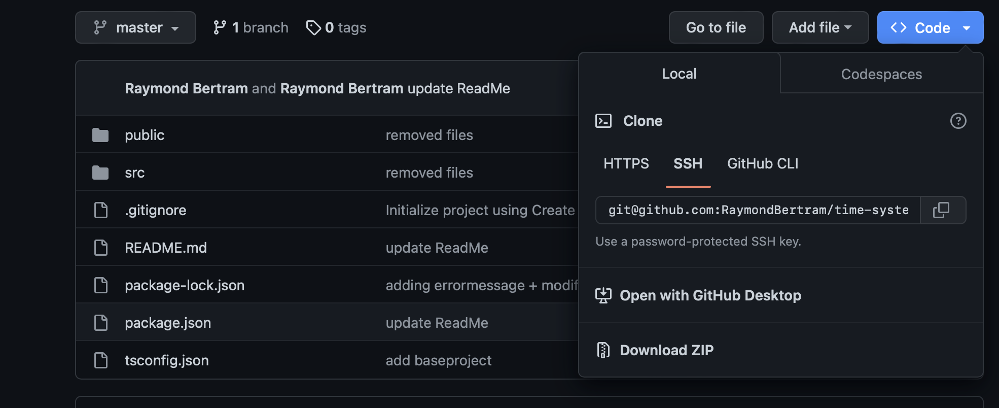

# Generelle Informationen (DE)
***[GitHub Repository](https://github.com/RaymondBertram/time-system)***

## Projekt Beschreibung
Das Projekt Time-System ist ein Low-Fidelity Prototype. Es wurde während meiner Studienzeit an der DHfPG als Praxis-Projektarbeit gebaut. Gebaut wurde es mit ***[ReactJS](https://react.dev)***, ***[Typescript](https://www.typescriptlang.org)*** und ***[CSS](https://www.w3schools.com/css/)***. Der Prototyp ist ein Zeiterfassungssystem, was im ersten Schritt die Zeit erfasst und im Nachhinein in einer Übersichtstabelle anzeigt. Die Übersichtstabelle zeigt die eingetragenen Zeiten. Die Daten werden im Form von Mocked Data dargestellt und dementsprechend nur im Frontend generiert.  

## System Anforderungen
Um das Projekt auf dem eigenen Maschine (macOS/Windows) laufen lassen zu können, wird ***[node.js](https://nodejs.org/de)*** und ein ***Code Editor***, wie ***[VSCode](https://code.visualstudio.com)*** benötigt. 

## Anleitung
Es wird davon ausgegangen, dass Sie sich ***[node.js](https://nodejs.org/de)*** und einen ***Code Editor*** runtergeladen haben. 

1. Downloaden Sie sich die ZIP-Datei aus dem Repository und speichern Sie dieses auf ihrem Desktop.

2. Als nächstes öffnen Sie ihren Code Editor und öffnen Sie das heruntergeladene Projekt. 

3. Im dritten Schritt öffnen Sie das Terminal des Code Editors und geben `npm start`. 

4. Das Projekt wird in ihrem Standardbrowser geöffnet. (Empfohlen wird GoogleChrome: Kopieren Sie einfach die URL und fügen Sie diese in Browser ein)

## Treten Probleme auf?
- Überprüfe ob node.js korrekt installiert wurde. 
- `node_modules` nicht korrekt installiert? Nutze `npm install --legacy-peer-deps`, um alle notwendigen `node_modules` zu installieren. 

## Erklärung node_modules
`node_modules` sind Pakete, die gebaut wurden um bereits entwickelte Komponenten wie beispielsweise [dayjs](https://day.js.org) wiederzuverwenden. Es dient dazu, dass nicht alles selbst entwickelt werden muss und um den Arbeitsaufwand zu minimieren. 

## Scripte
`npm start`

Lässt die App im Development Mode laufen.
Sobald das Skript im Terminal eingegeben wurde, öffnet sich ein Localhost [http://localhost:3000](http://localhost:3000). 

`npm install --legacy-peer-deps`

Installation aller notwendigen node_modules, die für die Ausführung der Anwendung in der lokalen Umgebung erforderlich sind.

# General Information (EN)
***[GitHub Repository](https://github.com/RaymondBertram/time-system)***

## Project Description
The Time System project is a low-fidelity prototype. It was built as a practical project during my time as a student at the DHfPG. It was built with ***[ReactJS](https://react.dev)***, ***[Typescript](https://www.typescriptlang.org)*** and ***[CSS](https://www.w3schools.com/css/)***. The prototype is a time recording system, which records the time in the first step and displays it afterwards in an overview table. The overview table shows the recorded times. The data is displayed as mocked data and therefore only generated in the frontend.

## Instructions
It is assumed that you have downloaded ***[node.js](https://nodejs.org/de)*** and a ***code editor***. 

1. Download the ZIP file from the repository and save it on your desktop.
[Download the ZIP file from the repository](./assets/repository.png).

2. Next, open your code editor and open the downloaded project. 

3. In the third step, open the terminal of the code editor and type `npm start`. 

4. The project will open in your default browser. (GoogleChrome is recommended: just copy the URL and paste it into the browser).

## Still Problems Running The App?
- check if node.js is correctly installed
- `node_modules` not correctly installed? Use `npm install --legacy-peer-deps` to correctly install them. 

## Explanation node_modules
`node_modules` are packages built to reuse already developed components such as [dayjs](https://day.js.org). It is used to avoid having to develop everything yourself and to minimise the workload.

## Available Scripts

`npm start`

Runs the app in the development mode.\
Open [http://localhost:3000](http://localhost:3000) to view it in your browser.

`npm install --legacy-peer-deps`

Installing all neccessary node_modules that are required for running the app on local enviroment. 

***Owner [Raymond Bertram](https://github.com/RaymondBertram)***